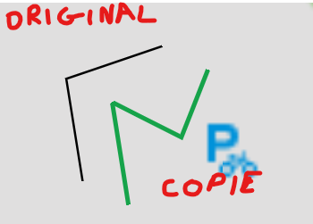

# 🐛 RAPPORT DE BUG : [BUG-desktop-002]

## 1. Informations Générales

- **ID Unique :** `BUG-desktop-002`
- **Date de détection :** 26/05/2026
- **Détecté par :** Clémence B.

---

## 2. Résumé du Problème

> **Titre :** [Tracé d'obstacles] - L'édition du tracé d'un obstacle est bugguée (duplication du dessin)

---

## 3. Contexte & Environnement

| Paramètre             | Valeur                      |
| :-------------------- | :-------------------------- |
| **Application / API** | Frontend application lourde |
| **Module**            | Tracé d'obstacles           |
| **Environnement**     | Local                       |
| **OS / Config**       | Windows 11                  |

---

## 4. Sévérité & Priorité

- **Gravité (Impact technique) :**
  - [ ] 🟥 **Bloquant** _(empêche l'utilisation)_
  - [x] 🟧 **Majeur** _(impact fort mais contournable)_
  - [ ] 🟨 **Mineur** _(Impact faible)_
  - [ ] 🟩 **Cosmétique** _(interface uniquement)_
- **Priorité :** [ ] Haute &nbsp;&nbsp; [x] Moyenne &nbsp;&nbsp; [ ] Basse

---

## 5. Description du Dysfonctionnement

### Comportement observé

Lorsqu'on tente d'éditer le tracé d'un obstacle, le dessin de l'obstacle est dupliqué, créant des artefacts visuels et rendant l'édition impossible.

### Comportement attendu

## Le tracé de l'obstacle doit être édité correctement sans duplication ni artefacts visuels.

## 6. Étapes pour reproduire

1. Déssiner un obstacle de type barrière et valider.
2. Cliquer sur le tracé créé pour le modifier.
3. Observer la duplication du dessin de l'obstacle.

---

## 7. Diagnostics & Preuves

### Résultat obtenu

Lorsqu'on tente d'éditer le tracé d'un obstacle, le tracé original reste sur place et sa copie peut être modifiée / déplacée indépendamment, ce qui n'est pas le comportement attendu.

### Résultat attendu

Le tracé de l'obstacle doit être édité correctement sans duplication ni artefacts visuels.

### Pièces Jointes & Logs

- **Captures d'écran / Vidéos :**
  
