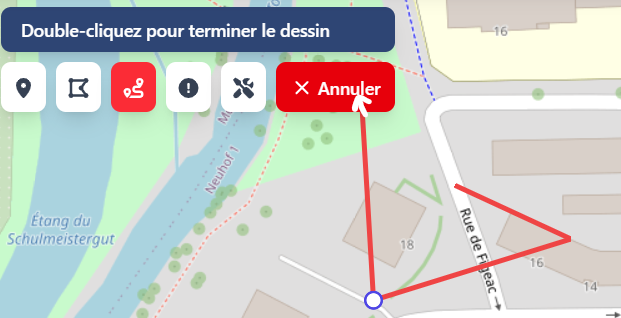
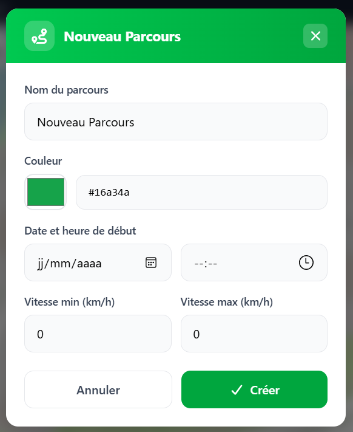

# 🐛 RAPPORT DE BUG : [BUG-desktop-003]

## 1. Informations Générales

- **ID Unique :** `BUG-desktop-003`
- **Date de détection :** 26/05/2026
- **Détecté par :** Clémence B.

---

## 2. Résumé du Problème

> **Titre :** [Tracés divers] - Entamer un dessin puis annuler celui-ci ouvre quand même la modale de validation de l'élément.

---

## 3. Contexte & Environnement

| Paramètre             | Valeur                      |
| :-------------------- | :-------------------------- |
| **Application / API** | Frontend application lourde |
| **Module**            | Tracé d'obstacles           |
| **Environnement**     | Local                       |
| **OS / Config**       | Windows 11                  |

---

## 4. Sévérité & Priorité

- **Gravité (Impact technique) :**
  - [ ] 🟥 **Bloquant** _(empêche l'utilisation)_
  - [ ] 🟧 **Majeur** _(impact fort mais contournable)_
  - [ ] 🟨 **Mineur** _(Impact faible)_
  - [x] 🟩 **Cosmétique** _(interface uniquement)_
- **Priorité :** [ ] Haute &nbsp;&nbsp; [ ] Moyenne &nbsp;&nbsp; [x] Basse

---

## 5. Description du Dysfonctionnement

### Comportement observé

Lorsqu'on entame un dessin puis qu'on annule celui-ci, la modale de validation de l'élément s'ouvre quand même.

### Comportement attendu

Le bouton d'annulation d'un dessin doit nettoyer la carte et désélectionner l'outil, sans rien ouvrir d'autre.

---

## 6. Étapes pour reproduire

1. Commencer un dessin de n'importe quel type
2. Cliquer sur le bouton d'annulation du dessin
3. Observer la modale de validation de l'élément qui s'ouvre malgré l'annulation du dessin

---

## 7. Diagnostics & Preuves

### Impact

Le comportement n’est pas bloquant puisque l'on peut fermer la modale manuellement pour continuer, mais c'est frustrant pour l'expérience utilisateur.

### Pièces Jointes & Logs

- **Captures d'écran / Vidéos :**
  
  

---

## 8. Résolution du Dysfonctionnement

### Analyse du problème

Le souci venait de l'ordre d'exécution dans la fonction `cancelDrawing`. Avant la correction, on changeait l'état de Mapbox en premier avec `changeMode("simple_select")`. Sauf que ce changement de mode force la librairie à terminer et valider le tracé en cours, ce qui déclenchait l'événement `draw.create` et ouvrait la modale. L'instruction `deleteAll()` qui arrivait à la ligne suivante effaçait bien le dessin de la carte, mais trop tard pour empêcher l'ouverture de la modale.

### Solution apportée

La solution adoptée est l’inversion de l'ordre des instructions dans la méthode `cancelDrawing` pour vider le cache avant de changer d'état. On commence par supprimer complètement le dessin en cours et ensuite seulement on repasse en sélection simple. Vu qu'il n'y a plus aucune donnée géométrique en mémoire au moment du changement de mode, MapboxDraw ne déclenche plus l'événement de création et la modale reste fermée.

### Vérification du bon fonctionnement

Pour valider la correction, voici les tests manuels à effectuer sur l'interface :

1. Lancer l'application et se rendre sur la vue de la carte.
2. Sélectionner un outil de dessin (ex: Equipement).
3. Placer un ou deux points sur la carte pour démarrer le tracé, mais sans le terminer (pas de double-clic).
4. Cliquer sur le bouton "Annuler".
5. Comportements attendus :
   - Le tracé en cours doit disparaître de l'écran.
   - La modale d’ajout de l’élément ne doit pas s'ouvrir.
   - L'outil de dessin doit être correctement désélectionné.
6. Répéter l'opération avec un autre type d'élément pour s'assurer que le comportement est bien global.
