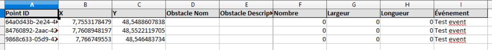
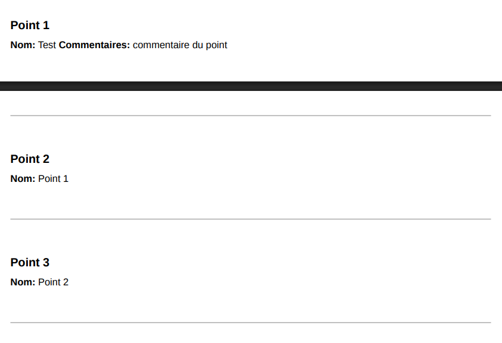

# Liste des fonctionnalités demandées

## V0

### Application lourde

- [x] affichage et navigation dans une carte de la ville de Strasbourg
- [x] recherche d'une adresse ou d'un lieu
- [x] placement sur la carte d'un type équipement sélectionné dans une liste de choix (barrière, bloc béton, etc.) en indiquant le nombre d'éléments de ce type placés
- [x] export possible des informations au format Excel

&rarr; **Remarque** : l'export ne semble pas fonctionner totalement, il manque plusieurs informations concernant les obstacles par exemple (nom de l'obstacle, nombre d'obstacles, etc.)

- [x] génération d'un fichier PDF pour impression de la carte avec les informations pertinentes

&rarr; **Remarque** : il semble manquer des informations dans le PDF, notamment les informations concernant les obstacles (nom de l'obstacle, nombre d'obstacles, etc.). Seul les informations (nom, description) des points d'intérêts sont présents bien que la carte soit complète.

### Application Mobile

- [x] affichage de sa position actuelle
- [x] enregistrement d'un point d'intérêt (coordonnées GPS + commentaire textuel + photos)
- [x] affichage et ordonnancement de la liste des points d'intérêt
- [x] simulation d'un déplacement ordonné dans la liste des points d'intérêt
- [ ] détection automatique de l'arrivée à un point puis guidage vers le suivant

&rarr; **Remarque** : Le point est à 10 mètres de chez moi, mais j'ai vraiment pas envie de sortir. Mon bâtiment fait plus de 10m, ça demande à être très très précis sur la localisation alors qu'on peut mettre quelques centaines de mètres de barrières ou autre équipements. Par défaut je mets que la feature est non-géré.

## V1

### Application lourde

- [x] Authentification via login/mot de passe sécurisé pour accéder à l'application
  - compte admin créé à l'installation (le mot de passe est demandé lors de l'installation)

&rarr; **Remarque** : un compte admin est créé à l'installation, mais il n'est pas possible ensuite de se déconnecter par exemple donc ça n'a pas beaucoup de sens.

- [x] Gestion des personnels
  - création, modification, suppression d'une personne (nom, prénom)
  - création, modification, suppression d'une équipe (numéro, nom, liste des membres)
- [x] Gestion des projets d'événement
  - création, modification, suppression d'un projet d'événement, identifié par un nom, une date et un ensemble de géométries permettant de le décrire (zone de couverture, tracé de la course, etc.)
  - sélection et visualisation d'un projet existant
  - modification du projet sélectionné (ajout de point d'intérêt, modification, déplacement, suppression, récupération de nouveaux points via mobile, etc.)
- [x] Gestion des points à sécuriser
  - ajout d'indications temporelles liée à un point (dates et heures prévues de pose et de dépose)
  - affichage chronologique (listes) des points à sécuriser (une liste de pose et une liste de dépose)

### Application Mobile

- [x] Affectation du mobile à un projet d'événement via QRCode sur l'application lourde (transfert des informations globales sur le projet)
- [ ] Visualisation des géométries liés au projet courant
- [x] Fonctionnalités de la v0 : saisie de points, géolocalisation, transfert vers l'application lourde

## V2

### Application lourde

- [x] Saisie sous forme de polyligne des éléments de type barrière ou bloc de béton sur la carte
- [x] Calcul automatique du nombre d'éléments nécessaires en fonction de la longueur de la polyligne

&rarr; **Remarque** : cette information ne semble visible qu'à la création de l'élément

- [x] Saisie d'informations chronologiques pour les parcours (date et heure de début, vitesse la plus rapide et la moins rapide)
- [x] Affichage chronologique des équipements sur la carte entre le début et la fin de la manifestation (défilement pas à pas)
- [x] Possibilité de filtrer les équipements par type (ex. ne voir que les barrières Héras)

- [x] Possibilité d'ajouter des points d'attention sur la carte (symbole ! par exemple avec une description associée, pas de notion de temps pour ces éléments)
- [x] Affectation d'éléments de sécurité à une équipe, associés à une action (pose ou dépose)
- [x] Génération d'un planning par équipe (PDF)

### Application Mobile

- [x] Récupération d'un planning sur l'application mobile
- [x] Affichage du planning et guidage d'un point à un autre
