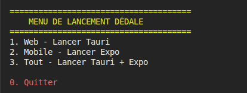
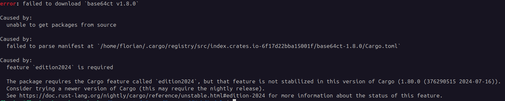
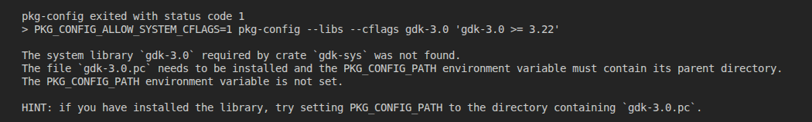
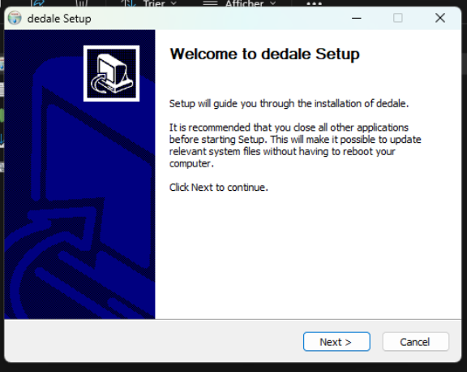

# Prise en main et déploiement
## Procédure d'installation
### **Observations préliminaires**
Aucune étape clairement définie n'est actuellement documentée pour installer et exécuter le projet dans un environnement de développement ou de production. La pipeline CI/CD n'est pas conçue pour générer un installateur auto-extractible de type « setup.exe ». Une analyse approfondie ainsi que des tests seront menés pour en valider le fonctionnement. Deux scripts (un pour Linux et un pour Windows) permettent de lancer tout ou partie du projet, selon les options choisies au démarrage.
### Installation pour le développement
#### Script sous Linux
Le script s'exécute directement via la commande bash `start-dedale.sh`, ce qui affiche immédiatement un menu permettant de choisir la partie du projet à lancer.

Malheureusement, une erreur apparaît dès le lancement de l'application.

L'application mobile avec Expo Go ne rencontre pas de problème particulier et se lance correctement avec la dernière version d'Expo disponible à ce jour.

#### Correction du script pour le lancement du « Web ».

##### Première tentative
Une recherche rapide met en évidence un problème potentiel nécessitant de passer en « nightly » concernant la version de Rust : `rustup install nightly`. Malheureusement, cela a échoué.
Il a fallu effectuer un override de la version à utiliser dans le projet avec `rustup override set nightly` pour pouvoir poursuivre.

Un autre problème, non mentionné et sans documentation, a eu lieu :

 Une recherche m'a permis de trouver la commande à exécuter : `sudo apt-get install libgtk-3-dev`. Mais pas de chance, ce paquet n'existe pas pour ma distribution...

##### Création d'un environnement système
Ayant une distribution Linux un peu particulière (FloX-OS, une distribution Debian-like sous ARM64), j'ai estimé que le plus simple était de créer un environnement de développement plus « standard ».
J'ai donc utilisé [Incus](https://linuxcontainers.org/fr/incus/introduction/)  pour créer un système paravirtualisé avec un crossing d'architecture semi-accéléré (QEMU-UserSpace + LXCFS + ShiftFS) sous Ubuntu 24.04.4 LTS (repository par défaut + Universe + Contrib).
Après quelques configurations du threading, de l'interception des syscalls (mknod + mkdnat, plus d'infos [ici](https://linuxcontainers.org/incus/docs/main/syscall-interception/) ) et de la traversée d'une interface OVN ([documentation](https://linuxcontainers.org/incus/docs/main/reference/devices_nic/#nic-ovn)), j'ai pu réessayer l'installation.
##### Lancement
Une fois ces étapes effectuées, et l'installation manuelle de nombreuses dépendances systeèes, le logiciel s'est lancé normalement après environ une minute de compilation des packages.

#### Commentaires
Malgré une configuration système qui peut expliquer quelques blocages, je note l'absence de guide ou d'informations concernant les prérequis système et les dépendances pour la compilation. Le seul moyen a donc été l'essai-erreur en boucle jusqu'à ce que la phase de compilation se termine.
La présence d'un guide des erreurs courantes « Troubleshooting » aurait permis d'éviter de faire des recherches parfois inutilement longues.
### Installation pour la Production
#### Sous Windows
À première vue, le pipeline d'intégration est conçu pour créer automatiquement un installateur. J'ai donc téléchargé l'artefact du dernier job de build et l'ai exécuté dans une machine virtuelle Windows Server 2025 et Windows 11 Pro for Workstations.
L'installation s'est avérée très simple : un double clic sur l'exécutable suffit à l'ouvrir.

Il suffit de se laisser guider pour que l'application s'ouvre ensuite automatiquement.

#### Sous Linux
Aucune procédure d'installation n'est précisée.

## Pipeline CI-CD
TODO
