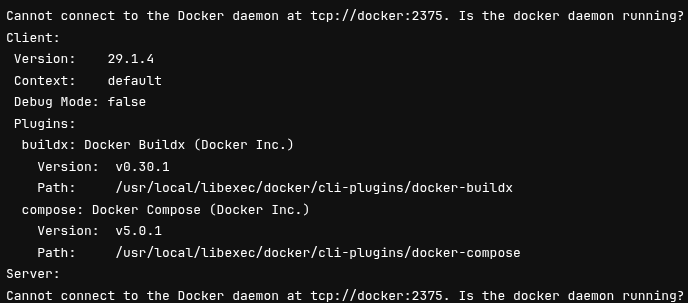

# Étape 1: Prise en main et déploiement
## Procédure d'installation
### **Observations préliminaires**
Aucune étape clairement définie n'est actuellement documentée pour installer et exécuter le projet dans un environnement de développement ou de production. La pipeline CI/CD semble conçue pour générer un installateur auto-extractible de type « setup.exe ». Une analyse approfondie ainsi que des tests seront menés pour en valider le fonctionnement. Deux scripts (un pour Linux et un pour Windows) permettent de lancer tout ou partie du projet, selon les options choisies au démarrage.
### Installation pour le développement
#### Script sous Linux
Le script s'exécute directement via la commande bash `start-dedale.sh`, ce qui affiche immédiatement un menu permettant de choisir la partie du projet à lancer.

Un tel menu semble approprié et permet de se lancer facilement. Je pense que c'est un agrément qui s'avère le bienvenu.

Malheureusement, une erreur apparaît dès le lancement de l'application.


L'application mobile avec Expo Go ne rencontre pas de problème particulier et se lance correctement avec la dernière version d'Expo disponible à ce jour.
J'ai donc simplement eu a scanner le QRCode avec Expo Go et l'applciation s'est correctement lancé.

#### Correction du script pour le lancement du « Web ».

##### Première tentative
Une recherche rapide met en évidence un problème potentiel nécessitant de passer en « nightly » concernant la version de Rust : `rustup install nightly`. Malheureusement, cela a échoué.
Il a fallu effectuer un override de la version à utiliser dans le projet avec `rustup override set nightly` pour pouvoir poursuivre.

Un autre problème, non mentionné et sans documentation, a eu lieu :

 Une recherche m'a permis de trouver la commande à exécuter : `sudo apt-get install libgtk-3-dev`. Mais pas de chance, ce paquet n'existe pas pour ma distribution...

##### Création d'un environnement système
Ayant une distribution Linux un peu particulière (FloX-OS, une distribution Debian-like sous ARM64), j'ai estimé que le plus simple était de créer un environnement de développement plus « standard ».
J'ai donc utilisé [Incus](https://linuxcontainers.org/fr/incus/introduction/)  pour créer un système paravirtualisé avec un crossing d'architecture semi-accéléré (QEMU-UserSpace + LXCFS + ShiftFS) sous Ubuntu 24.04.4 LTS (repository par défaut + Universe + Contrib).
Après quelques configurations du threading, de l'interception des syscalls (mknod + mkdnat, plus d'infos [ici](https://linuxcontainers.org/incus/docs/main/syscall-interception/) ) et de la traversée d'une interface OVN ([documentation](https://linuxcontainers.org/incus/docs/main/reference/devices_nic/#nic-ovn)), j'ai pu réessayer l'installation.
##### Lancement
Une fois ces étapes effectuées, et l'installation manuelle de nombreuses dépendances systeèes, le logiciel s'est lancé normalement après environ une minute de compilation des packages.


#### Commentaires
Malgré une configuration système qui peut expliquer quelques blocages, je note l'absence de guide ou d'informations concernant les prérequis système et les dépendances pour la compilation. Le seul moyen a donc été l'essai-erreur en boucle jusqu'à ce que la phase de compilation se termine.
La présence d'un guide des erreurs courantes « Troubleshooting » aurait permis d'éviter de faire des recherches parfois inutilement longues.
### Installation pour la Production
#### Sous Windows
À première vue, le pipeline d'intégration est conçu pour créer automatiquement un installateur. J'ai donc téléchargé l'artefact du dernier job de build et l'ai exécuté dans une machine virtuelle Windows Server 2025 et Windows 11 Pro for Workstations.
L'installation s'est avérée très simple : un double clic sur l'exécutable suffit à l'ouvrir.

Il suffit de se laisser guider pour que l'application s'ouvre ensuite automatiquement.

#### Sous Linux
Aucune procédure d'installation n'est précisée. Ceci étant, le client ayant demandé une installation sous Windows, cela n'est pas étonnant.
## Pipeline CI-CD
### Préambule
Le pipeline de CI-CD ne semble pas fonctionner, car aucune de ses instances ne s'est terminée sans erreur. À première vue, les journaux d'exécution indiquent tous un problème de communication avec le socket Docker : il s'agit donc d'un problème assez courant de « Docker in Docker » (Dind). Ce problème est simple à résoudre en configurant le niveau d'isolement du conteneur qui exécute le travail. Toutefois, cette solution n'est pas recommandée, car elle anéantit complètement la sécurité.
Voici un exemple pour le job `build-ci-image`

### Buildah et l'Open Container initiative à la rescousse
**Buildah** est un outil open source conçu pour construire des images de conteneurs conformes aux standards de l'**Open Container Initiative (OCI)**. Il permet de créer des images de manière flexible et légère, **sans nécessiter un démon Docker**, ce qui le rend particulièrement adapté aux environnements sécurisés ou aux pipelines CI/CD. Buildah offre des fonctionnalités avancées comme la construction d'images à partir de fichiers Dockerfile ou via des commandes interactives, tout en garantissant une compatibilité totale avec les spécifications OCI.

L'**Open Container Initiative (OCI)**, fondée en 2015 par des acteurs majeurs comme Docker, CoreOS et Google, vise à standardiser les formats et les runtime des conteneurs. Elle définit deux spécifications principales : l'**OCI Image Specification** (pour le format des images) et l'**OCI Runtime Specification** (pour l'exécution des conteneurs). Ces standards assurent l'interopérabilité entre différents outils (comme Podman, Buildah, ou containerd) et évitent les verrouillages technologiques. Buildah s'inscrit dans cet écosystème en produisant des images conformes à l'OCI, facilitant ainsi leur déploiement sur n'importe quelle plateforme compatible.

C'est donc l'absence de démon Docker avec Buildah qui le rend très intéressant pour ce besoin. Cependant, l'expérience m'a appris à être prudent : Docker et Buildah sont compatibles OCI, et normalement, les images Buildah devraient donc être parfaitement utilisables sous Docker. Sauf que dans la pratique, Docker implémente certaines fonctionnalités de manière sensiblement différente, surtout quand Buildah est utilisé en mode « unprivileged » (dans un environnement chrooté).
### Estimation du temps nécessaire
Pour les raisons citées un peu plus haut, je pense qu'il faut compter 20 heures de travail pour corriger, configurer et tester une solution sans démon Docker.


# Foire aux Questions
## **Installation pour le Développement**
**Q1 : Comment lancer le projet en développement sous Linux ?** **R :** Utilisez le script `start-dedale.sh` avec la commande :
```
bash start-dedale.sh
```
Un menu interactif s’affichera pour choisir la partie du projet à exécuter (Web, mobile, etc.).

---
**Q2 : Le script ****`start-dedale.sh`**** échoue au lancement du module Web. Que faire ?** **R :** Plusieurs problèmes peuvent survenir :
1.  **Version de Rust** :
	*   Installez la version _nightly_ :`rustup install nightly
	rustup override set nightly
	`
	*   Si l’installation échoue, vérifiez les dépendances système (ex: `libssl-dev`, `pkg-config`).
1.  **Dépendances manquantes** :
	*   Sous Ubuntu/Debian, installez :`sudo apt-get install libgtk-3-dev libssl-dev pkg-config
	`
	*   Pour les distributions non standard (ex: FloX-OS), créez un environnement virtuel (ex: Incus avec Ubuntu 24.04) ou installez les dépendances manuellement.
1.  **Erreurs de compilation** :
	*   Consultez les logs pour identifier les paquets manquants (ex: `libwebkit2gtk-4.0-dev` pour les applications Web).
---
**Q3 : Comment lancer l’application mobile avec Expo Go ?** **R :** Scannez le QR code généré par le script avec l’application **Expo Go** (disponible sur iOS/Android). Assurez-vous d’utiliser la dernière version d’Expo.
---
**Q4 : Quelles sont les dépendances système requises pour le développement ?** **R :** Voici une liste non exhaustive (à adapter selon votre distribution) :
*   **Rust** : `rustup` (version _nightly_ pour le module Web).
*   **Node.js** : Version LTS (pour le frontend).
*   **Dépendances système** :`sudo apt-get install libgtk-3-dev libssl-dev pkg-config libwebkit2gtk-4.0-dev
`
*   **Outils de conteneurisation** : Docker ou Podman (pour les dépendances isolées).
> ⚠️ **Note** : Un guide des dépendances par module (Web, mobile, backend) serait utile pour éviter les essais/erreurs.
---
## **Installation pour la Production**
**Q5 : Comment installer le projet en production sous Windows ?** **R :** Téléchargez l’artefact `setup.exe` depuis le pipeline CI/CD et exécutez-le. Suivez les instructions de l’assistant d’installation. L’application se lancera automatiquement à la fin.
---
**Q5 : Existe-t-il une procédure d’installation pour Linux en production ?** **R :** Aucune procédure officielle n’est documentée. Pour une installation manuelle :
1.  Compilez le projet en mode _release_ :`cargo build --release
`
1.  Installez les dépendances système (voir Q4).
1.  Déployez les binaires générés dans `/usr/local/bin/` ou un répertoire dédié.
> 💡 **Recommandation** : Créez un package `.deb` ou `.rpm` pour faciliter le déploiement.
---
## **Dépannage (Troubleshooting)**
**Q6 : Où trouver des solutions aux erreurs courantes ?** **R :** Voici une liste d’erreurs et leurs solutions :
|**Erreur**|**Solution**|
|---|---|
|error: linker 'cc' not found|Installez `build-essential` : `sudo apt-get install build-essential`.|
|libgtk-3-dev not found|Utilisez un environnement standard (Ubuntu/Debian) ou compilez depuis les sources.|
|Docker socket permission denied|Exécutez le runner CI en mode _privileged_ ou utilisez Buildah.|
|Expo QR code not working|Vérifiez que le serveur Expo est accessible depuis votre réseau.|
|Rust nightly compilation failed|Mettez à jour Rust : `rustup update nightly`.|


